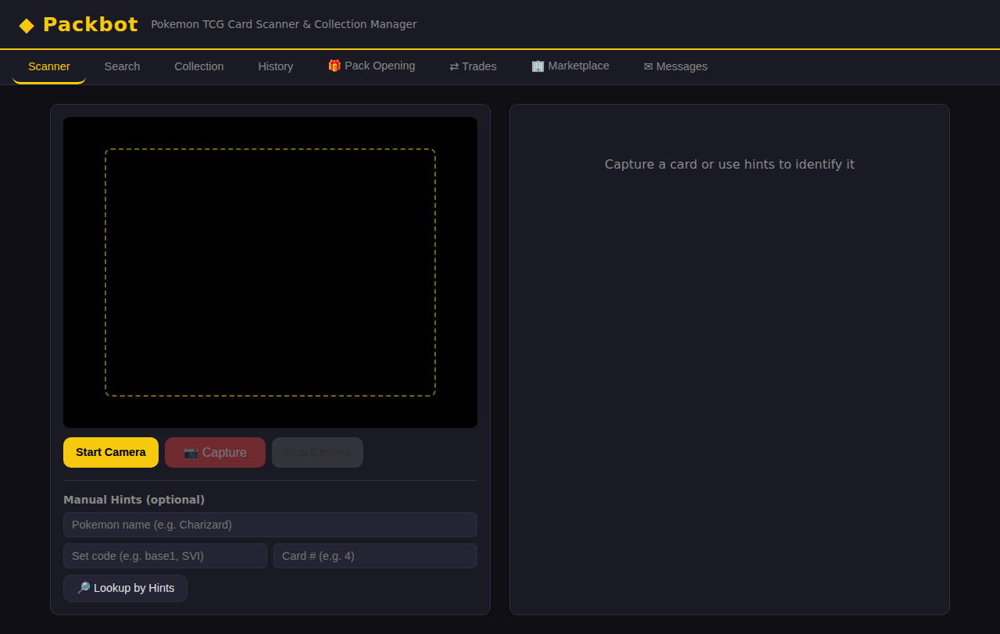
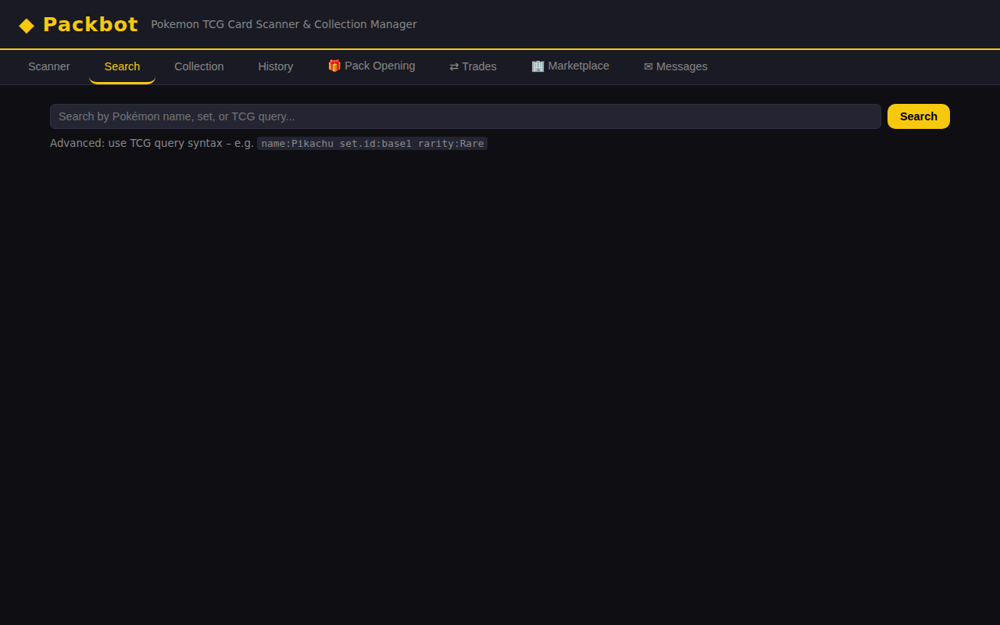
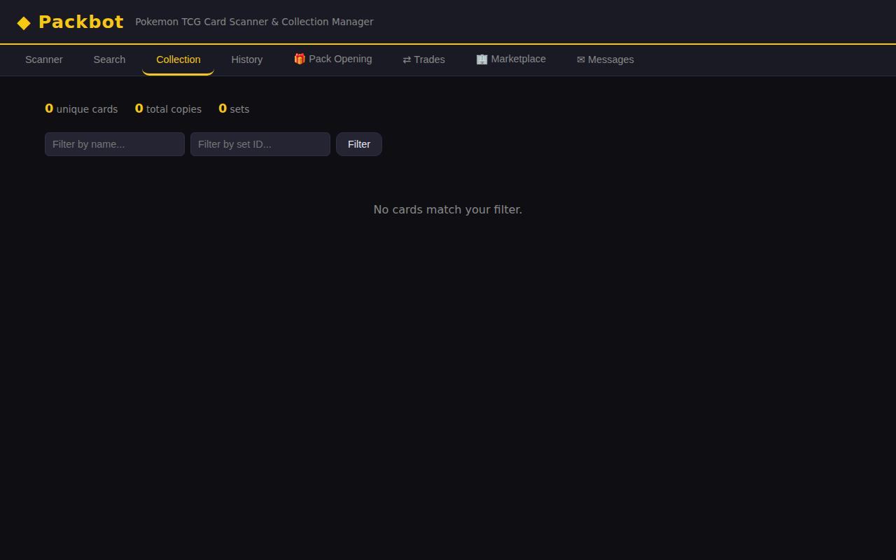
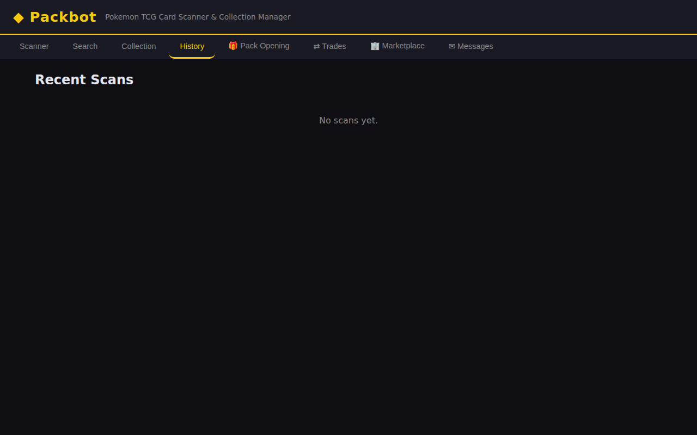
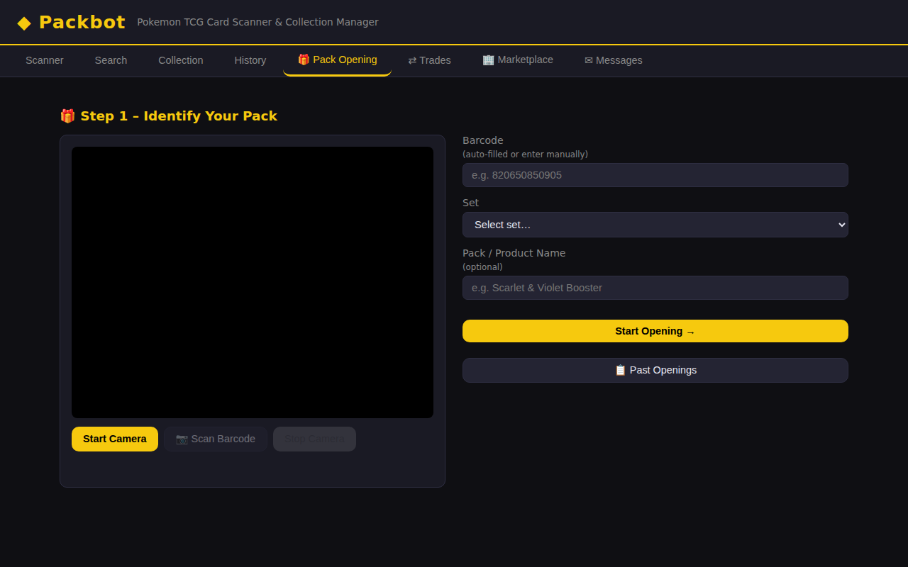
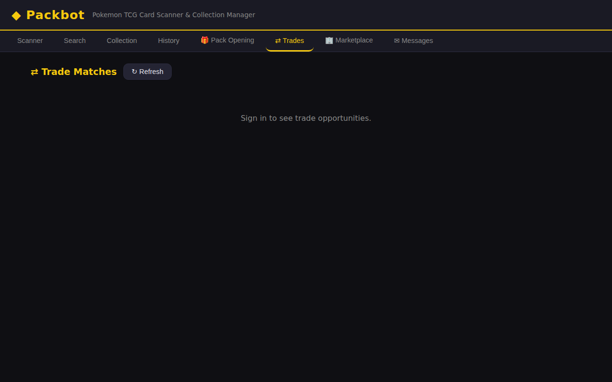
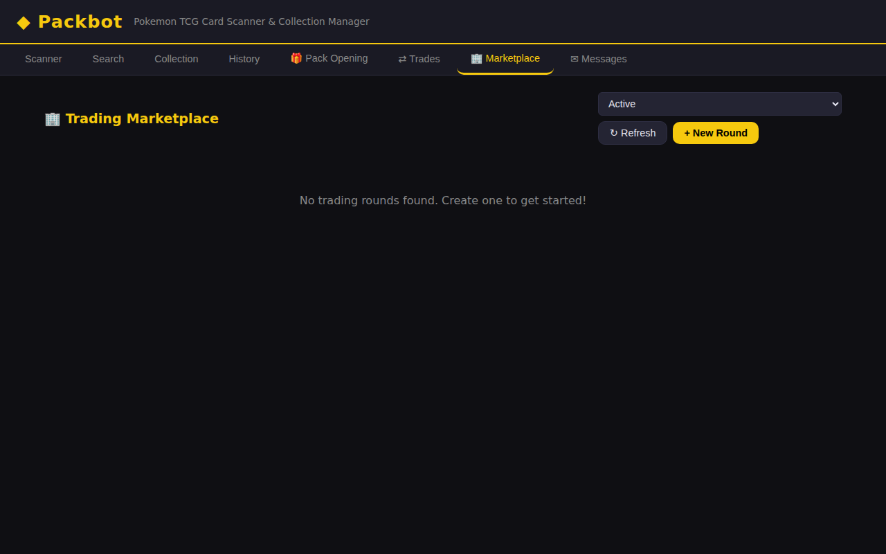
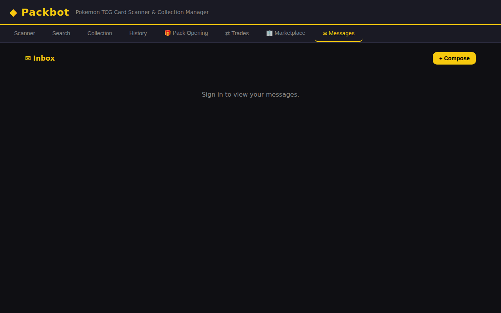

# Packbot – Complete App Walkthrough

Welcome to the complete walkthrough for **Packbot**, a web-based Pokemon TCG card scanner and collection manager. This guide covers every feature of the application with screenshots to help you get started.

---

## Table of Contents

1. [Getting Started](#getting-started)
2. [Scanner Tab](#1-scanner-tab)
3. [Search Tab](#2-search-tab)
4. [Collection Tab](#3-collection-tab)
5. [History Tab](#4-history-tab)
6. [Pack Opening Tab](#5-pack-opening-tab)
7. [Trades Tab](#6-trades-tab)
8. [Marketplace Tab](#7-marketplace-tab)
9. [Messages Tab](#8-messages-tab)
10. [Trainer Profile Page](#9-trainer-profile-page)
11. [API Reference](#10-api-reference)
12. [Tips & Tricks](#11-tips--tricks)

---

## Getting Started

### Prerequisites

- **Python 3.8+** installed
- A modern web browser (Chrome, Firefox, Edge, or Safari)
- *(Optional)* A webcam for camera-based card scanning
- *(Optional)* A [Pokemon TCG API key](https://dev.pokemontcg.io/) for higher rate limits

### Installation

```bash
# 1. Clone the repository
git clone https://github.com/boyroywax/Packbot-.git
cd Packbot-

# 2. Install Python dependencies
pip install -r requirements.txt

# 3. (Optional) Configure your environment
cp .env.example .env
# Edit .env and add your POKEMON_TCG_API_KEY for higher API rate limits

# 4. Start the application
python app.py
```

### Opening the App

Once the server is running, open your browser and navigate to:

```
http://localhost:5000
```

You will see the Packbot interface with a navigation bar across the top containing eight tabs: **Scanner**, **Search**, **Collection**, **History**, **Pack Opening**, **Trades**, **Marketplace**, and **Messages**.

---

## 1. Scanner Tab

The **Scanner** tab is the default view and the heart of Packbot. It allows you to identify Pokemon TCG cards using your webcam or by entering card details manually.



### Camera Scanning

1. Click **Start Camera** to activate your webcam.
2. Position a Pokemon card within the dashed guide frame in the camera preview.
3. Click **📷 Capture** to take a photo of the card.
4. Packbot analyzes the captured image using perceptual hashing and the Pokemon TCG API to identify the card.
5. The identified card appears in the **result panel** on the right with its image, name, set, rarity, and a confidence score.

### Manual Lookup

If you don't have a webcam or prefer to look up a card directly:

1. Enter any combination of hints in the **Manual Hints** section:
   - **Pokemon name** – e.g., `Charizard`
   - **Set code** – e.g., `base1`, `SVI`
   - **Card number** – e.g., `4`
2. Click **🔎 Lookup by Hints** to search the TCG API.
3. The best match (and alternative candidates) will appear in the result panel.

### Adding to Your Collection

Once a card is identified:

1. Select the card **Condition** (NM, LP, MP, HP, or DMG).
2. Set the **Quantity**.
3. Check **Foil / Holo** if applicable.
4. Optionally add **Notes**.
5. Click **+ Add to Collection** to save the card.

A green confirmation message appears when the card is successfully added.

---

## 2. Search Tab

The **Search** tab lets you browse the entire Pokemon TCG card database powered by the [pokemontcg.io](https://pokemontcg.io) API.



### Basic Search

1. Type a Pokemon name or keyword into the search bar (e.g., `Pikachu`).
2. Click **Search** or press Enter.
3. Results appear as a grid of card tiles showing each card's image, name, and set info.

### Advanced Search

Use TCG query syntax for precise filtering:

| Query Example | Description |
|---------------|-------------|
| `name:Pikachu` | Cards named Pikachu |
| `set.id:base1` | Cards from Base Set |
| `rarity:Rare` | Only rare cards |
| `name:Charizard set.id:base1` | Charizard from Base Set |
| `types:Fire` | Fire-type Pokemon |
| `hp:[100 TO *]` | Cards with 100+ HP |

### Viewing Card Details

Click any card tile to open a **detail modal** showing:

- Full-size card image
- Card name, set, number, and rarity
- **Market prices** from TCGPlayer and CardMarket (low, mid, high, and market values)

---

## 3. Collection Tab

The **Collection** tab displays all cards you have added to your personal collection.



### Collection Statistics

At the top of the tab, a stats bar shows:

- **Unique cards** – Number of distinct cards
- **Total copies** – Sum of all card quantities
- **Sets** – Number of different sets represented

### Filtering

Use the filter inputs to narrow down your collection:

- **Filter by name** – Type a Pokemon name to filter
- **Filter by set ID** – Enter a set code (e.g., `base1`)
- Click **Filter** to apply

### Collection Table

Each card in your collection is displayed in a table with:

| Column | Description |
|--------|-------------|
| Image | Small card thumbnail |
| Name | Pokemon/card name |
| Set | Set name and ID |
| Number | Collector number |
| Condition | NM, LP, MP, HP, or DMG |
| Qty | Number of copies |
| Foil | Whether the card is foil/holo |
| Notes | Any notes you added |
| Actions | Delete button to remove the entry |

Results are paginated – use the pagination controls at the bottom to navigate between pages.

---

## 4. History Tab

The **History** tab provides a chronological log of every card scan you have performed.



### Scan History Entries

Each entry in the history shows:

- **Card thumbnail** – Small image of the scanned card
- **Card name** – The identified Pokemon/card
- **Set and number** – Which set the card belongs to
- **Scan method** – Whether the card was identified via camera or manual lookup
- **Confidence** – How confident the identification was
- **Timestamp** – When the scan occurred

The history is listed in reverse chronological order (newest scans first), making it easy to review recent activity.

---

## 5. Pack Opening Tab

The **Pack Opening** tab guides you through a three-step process for tracking booster pack openings.



### Step 1 – Identify Your Pack

1. **Scan barcode** *(optional)*: Use the camera to scan a pack's barcode for automatic identification.
2. **Manual entry**: Fill in the pack details:
   - **Barcode** – The UPC barcode number (auto-filled from scan or enter manually)
   - **Set** – Select the set from the dropdown menu
   - **Pack / Product Name** – Optional descriptive name (e.g., "Scarlet & Violet Booster")
3. Click **Start Opening →** to proceed to Step 2.

You can also click **📋 Past Openings** to review your previous pack opening sessions.

### Step 2 – Open the Pack

Once a session is started:

1. **Camera capture**: Start the camera and use **📷 Capture Now** to photograph each card as you pull it from the pack.
2. **Auto-Detect**: Toggle this to automatically detect and identify cards as they appear in the camera feed.
3. **Manual add**: If you know the card number, type it in the manual add section and click **Lookup & Add**.
4. Each identified card appears in the **Cards Found** list on the right, showing the card image, name, set, and confidence score.
5. You can remove incorrectly identified cards using the ✕ button.
6. Click **Done Opening →** when you have added all cards from the pack.

### Step 3 – Review & Save

After finishing the opening:

1. Review the grid of all cards pulled from the pack.
2. Choose whether to **Add all cards to my collection** (checked by default).
3. Select the **Condition** for the cards (NM is default for fresh pack pulls).
4. Click **Save to Collection** to save all cards at once.
5. Click **← Open Another Pack** to start a new session.

### Pack History

Access your complete pack opening history to see:

- Pack name and set
- Date of opening
- Number of cards pulled
- Status (completed, active, or cancelled)
- Expandable card grid showing all cards from each opening

---

## 6. Trades Tab

The **Trades** tab helps you discover trade opportunities with other Packbot users.



> **Note:** You must be signed in to access trade features.

### Trade Sections

The tab is divided into two sections:

1. **📈 People who want your cards** – Shows other users who are looking for cards that you have in your collection. This helps you identify potential trade partners.

2. **📋 Cards you want from others** – Shows cards on your wishlist that other users have available for trade.

### Trade Match Details

Each trade match card displays:

- Card image and name
- Set and rarity information
- Current market price
- The username of the potential trade partner (clickable to view their profile)
- Action buttons to initiate a trade or send a message

Click **↻ Refresh** to update the trade matches with the latest data.

---

## 7. Marketplace Tab

The **Marketplace** tab provides a structured trading platform with timed trading rounds.



### Trading Rounds

Trading happens in organized **rounds** – timed sessions where users can post and accept trade offers.

#### Creating a Round

1. Click **+ New Round**.
2. Fill in the form:
   - **Round Name** – A descriptive title (e.g., "Base Set Trading Pool")
   - **Description** – Optional details about the round
   - **Duration (minutes)** – How long the round stays active
3. Click **Create Round** to start.

#### Browsing Rounds

- Use the **status filter** dropdown to view "All Rounds", "Active" only, or "Settled" rounds.
- Click **↻ Refresh** to reload the list.
- Click any round card to view its details.

#### Making Trade Offers

Inside a round's detail view:

1. Enter the **Card You Offer** (card ID, e.g., `base1-4`).
2. Enter the **Card You Want** (card ID, e.g., `base1-15`).
3. Click **Submit Offer**.
4. Browse other users' offers and accept trades that interest you.

#### Settling a Round

The round creator can click **✅ Settle Round** to finalize all accepted trades when the round ends.

---

## 8. Messages Tab

The **Messages** tab provides a built-in messaging system for communicating with other traders.



> **Note:** You must be signed in to access messages.

### Inbox

The inbox displays all received messages with:

- **Unread indicator** – Blue dot and bold text for unread messages
- **Sender name** – Who sent the message
- **Subject** – Message subject line
- **Timestamp** – When the message was received

Click any message to open it in the detail view.

### Reading Messages

The message detail view shows:

- Full subject and sender information
- Complete message body
- **Reply** section to respond directly
- **Delete** button to remove the message

### Composing Messages

1. Click **+ Compose** in the inbox header.
2. Fill in:
   - **To** – Recipient's username
   - **Subject** – Optional subject line
   - **Message** – Your message body
3. Click **Send** to deliver the message.

The unread message count appears as a red badge on the Messages tab in the navigation bar.

---

## 9. Trainer Profile Page

Each user has a public profile page accessible at `/u/<username>`. Profiles showcase a trainer's collection and trading activity.

### Profile Header

- **Avatar** and **username**
- **Joined date** – When the trainer created their account
- **Stats chips** showing: unique cards, total copies, listing count, and wishlist count

### Profile Tabs

| Tab | Description |
|-----|-------------|
| **📚 Collection** | Browse the trainer's full card collection with pagination |
| **🔄 For Trade** | Cards the trainer has listed for trade |
| **💰 For Sale** | Cards the trainer has listed for sale (with asking prices) |
| **✨ Wishlist** | Cards the trainer is looking for |

Profile pages are useful for evaluating potential trade partners before initiating a trade.

---

## 10. API Reference

Packbot exposes a REST API that powers the frontend and can be used for integrations.

### Card Operations

| Method | Endpoint | Description |
|--------|----------|-------------|
| `POST` | `/api/scan/image` | Identify a card from a camera image + hints |
| `POST` | `/api/scan/text` | Identify a card from free-form text |
| `GET` | `/api/cards/search?q=...` | Search the TCG card database |
| `GET` | `/api/cards/<id>` | Fetch details for a single card |
| `GET` | `/api/cards/<id>/price` | Fetch market prices for a card |
| `GET` | `/api/sets` | List all available TCG sets |

### Collection Management

| Method | Endpoint | Description |
|--------|----------|-------------|
| `GET` | `/api/collection` | Get your collection |
| `POST` | `/api/collection` | Add a card to your collection |
| `DELETE` | `/api/collection/<id>` | Remove a collection entry |
| `GET` | `/api/collection/stats` | Get collection statistics |

### Scan History

| Method | Endpoint | Description |
|--------|----------|-------------|
| `GET` | `/api/scans` | Retrieve your scan history |

### Scan Request Example

```json
POST /api/scan/image
{
  "image": "<base64 data URL from canvas>",
  "pokemon_name": "Charizard",
  "set_code": "base1",
  "card_number": "4"
}
```

### Card Condition Codes

| Code | Meaning |
|------|---------|
| NM | Near Mint |
| LP | Lightly Played |
| MP | Moderately Played |
| HP | Heavily Played |
| DMG | Damaged |

---

## 11. Tips & Tricks

### Getting Better Scan Results

- **Good lighting** – Ensure the card is well-lit and free from glare.
- **Flat surface** – Place the card on a flat, contrasting background.
- **Fill the frame** – Position the card so it fills the dashed guide area.
- **Use hints** – Providing a Pokemon name or set code dramatically improves accuracy.

### Managing Your Collection

- Use the **Foil / Holo** checkbox to distinguish foil variants from regular prints.
- Add **Notes** to track where you got a card or any special details.
- Use **set ID filters** in the Collection tab to view cards from specific sets.

### Trading Effectively

- Keep your **wishlist** updated so the Trades tab can find matches.
- List cards **for trade** to appear in other trainers' trade match results.
- Use **Messages** to negotiate trades before committing in the Marketplace.
- Check a trader's **profile page** to see their full collection before proposing a trade.

### API Key for Better Performance

Without an API key, the Pokemon TCG API limits requests. For the best experience:

1. Get a free API key at [dev.pokemontcg.io](https://dev.pokemontcg.io/).
2. Add it to your `.env` file:
   ```
   POKEMON_TCG_API_KEY=your-key-here
   ```
3. Restart the server.

---

## Architecture Overview

```
app.py          Flask application + REST API routes
scanner.py      Card identification (image hashing, OCR, barcode)
tcg_api.py      Pokemon TCG API client
database.py     SQLite/PostgreSQL persistence layer
notifier.py     Email/notification system
static/
  index.html    Single-page frontend (all tabs)
  profile.html  Public trainer profile page
  style.css     Dark-theme stylesheet
  app.js        Frontend application logic
```

---

*For more information, see the [README](../README.md) or open an issue on GitHub.*
